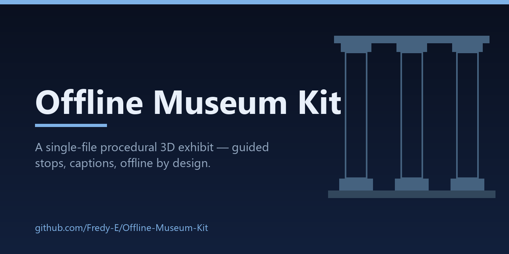
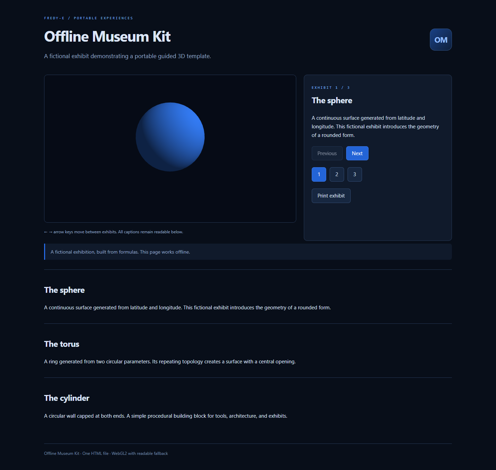

<p align="center">
  
</p>

<p align="center">
  <a href="https://github.com/Fredy-E/Offline-Museum-Kit/actions/workflows/verify.yml"></a>
  
  
  
  
</p>

## What this is

Open `index.html` directly. The page embeds its styles, geometry generator, WebGL2 renderer, and fictional exhibit captions. Previous/Next buttons, numbered stops, and arrow keys navigate three views. Captions remain readable when WebGL2 is unavailable, and print styles produce a text exhibit.

This first version is a template demonstration with discrete authored views — not a continuous walkthrough or a full museum authoring system. It uses no network assets and no downloaded models; the exhibits are fictional geometry examples.



## Features

- One self-contained HTML file: styles, geometry, renderer, and captions embedded; no runtime fetches.
- Three fictional exhibits with Previous/Next, numbered stops, and arrow-key navigation (clamped at both ends).
- Captions stay readable without WebGL2; print styles produce a text-only exhibit.
- `exhibit.json` is the editable source; `build/build_museum.py` rebuilds the page reproducibly.

## Run

Open `index.html` in a modern browser — no install or server needed. `npm ci` is only required for the test suites.

## Edit and rebuild

`exhibit.json` is the editable source dataset. After editing, rebuild the standalone page:

```sh
python build/build_museum.py
```

The page deliberately does not fetch the JSON at runtime — the build tool embeds everything (the shared family style and mesh engine are vendored under `build/vendor/`). The build is byte-reproducible: `python tests/test_build_museum.py` rebuilds in a sandbox and fails if the output no longer matches the approved `index.html`, and CI additionally runs the builder followed by `git diff --exit-code` to catch any uncommitted mutation.

## Tests

Unit checks (no dependencies):

```sh
node tests/exhibit.test.cjs
```

Rebuild reproducibility and safe JSON embedding (Python, stdlib only):

```sh
python tests/test_build_museum.py
```

Browser end-to-end checks (Playwright 1.63.0, dev-only):

```sh
npm ci
npm run test:browser
```

The browser checks open the page via `file://` and through a loopback-only static server, assert that no request leaves the local machine, read real pixels back from the WebGL2 drawing buffer, and exercise navigation/clamping/keys/dots, the no-WebGL2 fallback, and print media styles. On dev machines they use the installed Chrome; in CI they use the bundled Playwright Chromium. Override with `PW_CHANNEL=chrome|msedge|bundled`.

CI (badge above) runs all suites on every push, including the Python rebuild check. A manual `pages.yml` workflow prepares a static artifact for GitHub Pages; it does not enable or publish Pages by itself.

## Limits

- A template demonstration with three discrete authored views — not a walkthrough, not an authoring system.
- Exhibits are fictional procedural shapes; no media, no external models, no network assets.
- Without WebGL2 the canvas is hidden and captions carry the content; nothing renders.
- After editing `exhibit.json`, regenerate `index.html` with the build script instead of hand-editing the page.

## Next

An authoring UI, camera paths through a shared room, embedded media, and an accessibility review.

## See also

[DriverLens](https://github.com/Fredy-E/DriverLens) · [ARM64 Compatibility Radar](https://github.com/Fredy-E/ARM64-Compatibility-Radar) · [MeshLab Mini](https://github.com/Fredy-E/MeshLab-Mini) · [Diagnostic Scan Diff](https://github.com/Fredy-E/Diagnostic-Scan-Diff) — small local-first tools built for Windows-on-ARM work.
